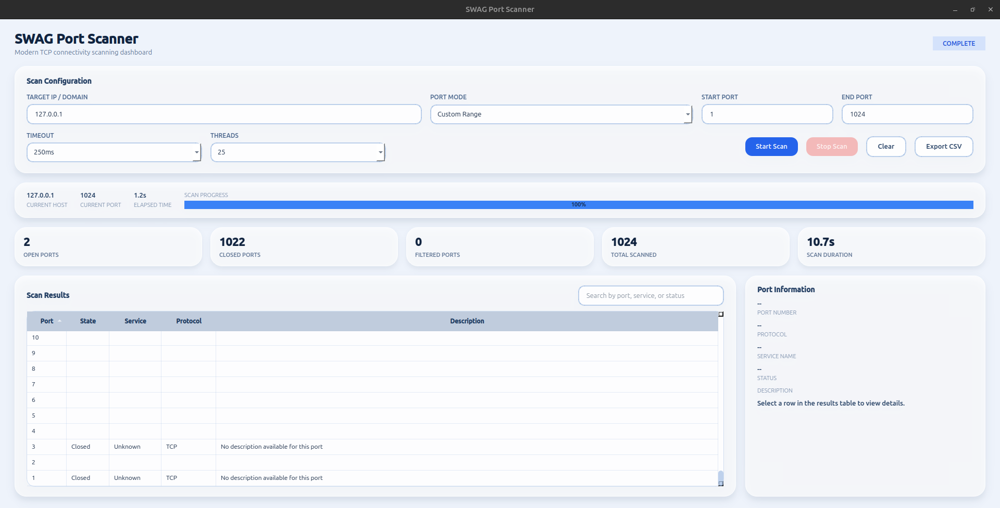

# SWAG Port Scanner

A modern TCP Port Scanner built with **Python** and **PyQt6** featuring a clean glassmorphism-inspired interface, multithreaded scanning, live statistics, and CSV export.

## Features

- Scan IP addresses or domains
- Common, Top 100, Top 1000 & Custom Port Range
- Multithreaded TCP scanning
- Live progress and statistics
- Service name detection
- Search and filter results
- Export open ports to CSV
- Responsive PyQt6 GUI

## Screenshot



## Installation

```bash
git clone https://github.com/govind0911/swag-port-scanner.git
cd swag-port-scanner

python3 -m venv venv
source venv/bin/activate

pip install PyQt6

python3 main.py
```

## Tech Stack

- Python 3.12
- PyQt6
- Socket Programming
- ThreadPoolExecutor

## License

MIT License
